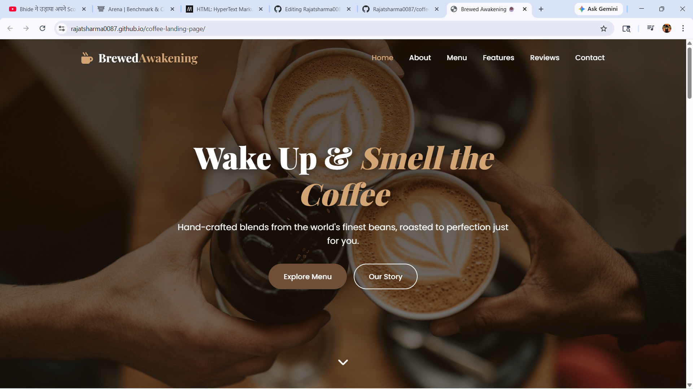

# ☕ Brewed Awakening — Coffee Landing Page

Live site → https://rajatsharma0087.github.io/coffee-landing-page/

A modern, responsive landing page for a coffee shop/brand built with HTML, CSS, and vanilla JavaScript.

## Features

- **Responsive Design**: Fully responsive layout that works on all devices
- **Smooth Animations**: Scroll animations and smooth transitions
- **Contact Form**: Integrated with Formspree for easy form submissions
- **Mobile Navigation**: Hamburger menu for mobile devices
- **Modern UI**: Clean and professional design with coffee-themed colors
- **Product Showcase**: Grid layout for displaying coffee products
- **Testimonials**: Customer reviews section
- **SEO Friendly**: Semantic HTML structure

## Sections

1. **Navigation Bar**: Fixed navigation with smooth scrolling
2. **Hero Section**: Eye-catching header with call-to-action buttons
3. **About Section**: Information about the coffee brand with features
4. **Products Section**: Showcase of coffee products with hover effects
5. **Testimonials**: Customer reviews and ratings
6. **Contact Section**: Contact form and information
7. **Footer**: Links and additional information

## Setup Instructions

### 1. Clone or Download

Download all files and maintain this folder structure:
